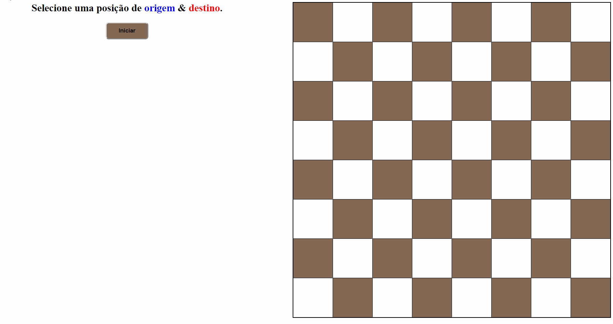

# Projeto de Algoritmos 2/2019

## Projeto 01 sobre Grafos

**Aluno:** Gustavo Nogueira Rodrigues - 17/0144259
**Professor:** Maurício Serrano

### Objetivo:
Encontrar os movimentos que conduza o cavalo do jogo de xadrez de uma origem até o seu destino com a menor quantidade possível de movimentos.

Baseado na questão 1100 do URI (<https://www.urionlinejudge.com.br/judge/pt/problems/view/1100>)
